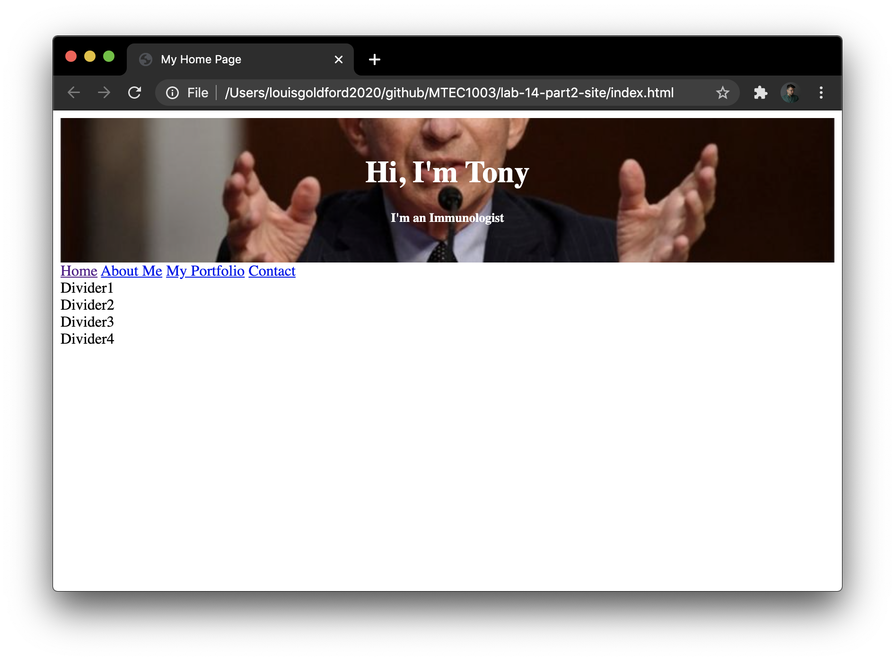
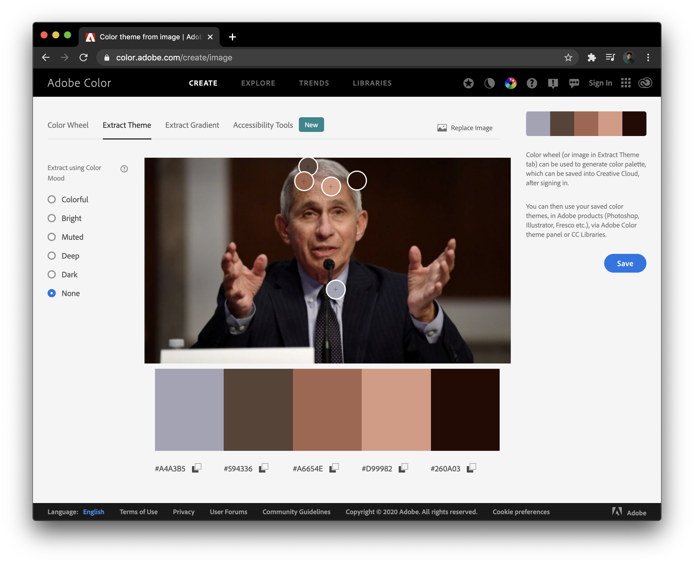
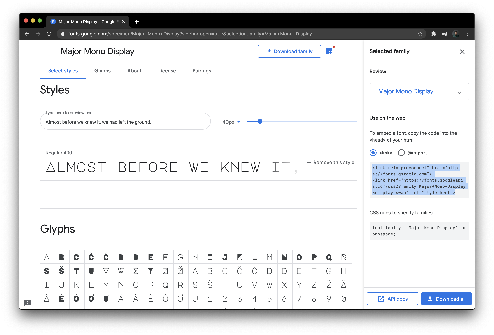
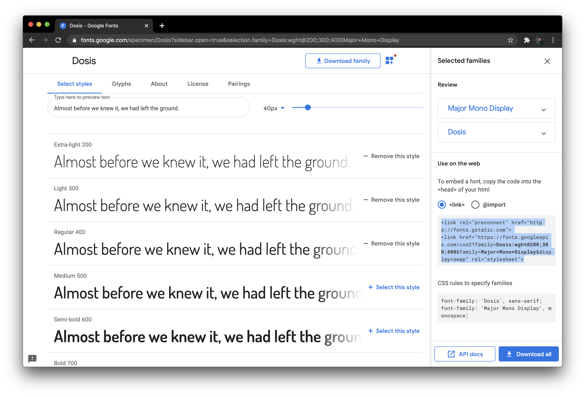
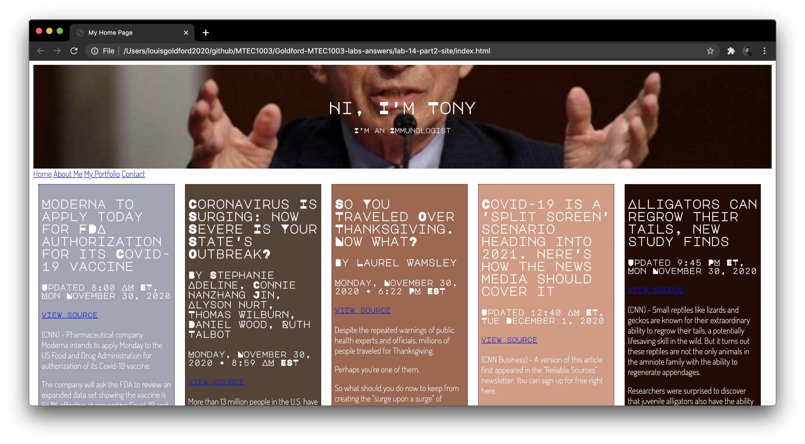
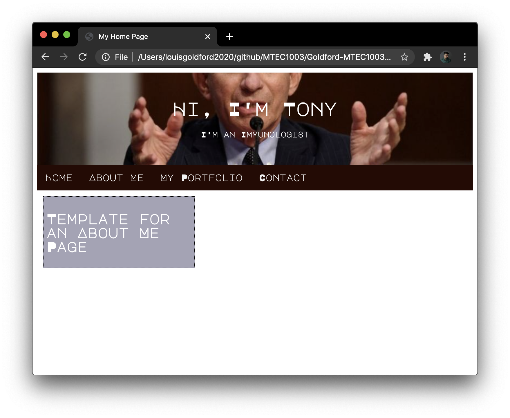

---
# Feel free to add content and custom Front Matter to this file.
# To modify the layout, see https://jekyllrb.com/docs/themes/#overriding-theme-defaults

layout: default
---

# Lab 14: Advanced Web Design + _GitHub Pages_  

#### C O N T E N T S  
1. <a href="#overview">Overview of This Lab</a>  
2. <a href="#diving">Creating a Page With `
` Containers</a>    
  - <a href="#hero">Make a Container for a "Hero Image"</a>    
  - <a href="#naving">Make a Container for a Navbar</a>  
  - <a href="#textelems">Make Containers for Body Text Elements</a>  
  - <a href="#extcss">Link to an External CSS Style Sheet</a>  
3. <a href="#heroimg">Adding + Styling a Hero Image</a>  
4. <a href="#adobecolor">Extracting Your Site's Color Scheme from a Photo</a>  
5. <a href="#stylingdivs">Styling the Divs</a>  
  - <a href="#globalunique">Setting Global and Unique CSS Rules</a>   
  - <a href="#addtext">Adding Dummy Text to Each Div</a>   
6. <a href="#googlefonts">Using Google Fonts</a>  
7. <a href="#stylingnav">Styling the Navbar</a>  
8. <a href="#linkingpages">Linking New Pages</a>  
9. <a href="#githubpages">Pushing Your Site to _GitHub Pages_</a>  

* * *  

## 1. Overview of This Lab  

In this lab, we'll make a simple website in HTML and stylize it with CSS, and then push the entire website to _GitHub Pages_ for hosting on the web.   

But this time, we'll employ some more advanced web design concepts by building a site that includes:  
* some interrelated pages (e.g. a main page, "About Me", "Contact", etc.)  
* a navigation menu, or "navbar" to link these pages together (with so-called "sticky" positioning)
* a "hero image" at the top of each page  
* using `
` (i.e. HTML _"dividers"_) to separate and position your content on a page  
* custom font integration using Google Fonts  
* building a custom color scheme for your site using Adobe Color  

In order to do this, start by creating a new repository on _GitHub_. Call it **lab-14-site** and then **CLONE** it onto your local machine inside your **/mtec1003** folder. (As always, use your knowledge of git and all of your previous references in order to do this.)   

* * *   

## 2. Creating a Page With `
` Containers  

In your new **/lab-14-site** repository, start by creating a new HTML file and immediately save it as **index.html.  

This will be the front page of your site; i.e. your "home page."  

Type "HTML" + the `TAB` key to generate a boilerplate HTML document.  

Inside your `<head>` tag, and in between the `<title></title>`, type the name of your page: call it "My Home Page".  

### Make a Container for a "Hero Image"

Now, inside your page's `<body>` tag, type "div" and then press the `TAB` key to format the proper tags. So far, your page should look like this:  


<!DOCTYPE html>
<html>
  <head>
    <meta charset="utf-8">
    <title>My Home Page</title>
  </head>
  <body>
    

    

  </body>
</html>


Now, with your cursor already positioned between the `
` tags you just created (i.e. on line 9 above), make _another_ set of `
` tags; i.e. one `
` within another, like so:


<!DOCTYPE html>
<html>
  <head>
    <meta charset="utf-8">
    <title>My Home Page</title>
  </head>
  <body>
    

      

      

    

  </body>
</html>


On line 8, between the quotation marks, create a class identifier, and call it: "hero-image". On line 9, inside the "inner" `
` element, create another class label by typing "hero-text" between the quotation marks.  

These two nested `
` elements will contain the banner image (sometimes called "hero image") that will span the top of our web page.  

Now, inside the innermost `
`, add the following `<h1>` and `
` elements:  


<h1>Hi, I'm Tony</h1>
<h5>I'm an Immunologist</h5>


This text will be placed on top of our "hero image". We'll format all of this using the class selectors we've just labeled in our CSS file later...  

So far, your page with the complete "hero image" container system should look like this:  


<!DOCTYPE html>
<html>
  <head>
    <meta charset="utf-8">
    <title>My Home Page</title>
  </head>
  <body>
    

      

        <h1>Hi, I'm Tony</h1>
        <h5>I'm an Immunologist</h5>
      

    

  </body>
</html>


### Make a Container for a Navbar  

Next, let's make containers for a "navbar" — i.e. a navigation menu — so we can easily navigate our site.  

Between lines 13 and 14, create another `
` as you had done before...  

But this time, delete the class selector label from the opening tag, and replace it with an ID selector. Label this one "navbar". We'll use this ID selector to style our navbar uniquely in CSS.  

Inside these div tags, add some `<a>` link elements that we'll use for each page on our site:  


<a href="index.html">Home</a>
<a href="aboutme.html">About Me</a>
<a href="myportfolio.html">My Portfolio</a>
<a href="contact.html">Contact</a>


_By the way: **make sure all links and divs are properly indented!**_  

### Make Containers for Body Text Elements    

Next, make 4 identical `
` elements, which we'll use to place content on our home page. In this example, we'll be placing news stories inside these divs.  

Inside each, provide placeholder text by labeling them "Divider1", "Divider2", and so on:  



Divider1

Divider2

Divider3

Divider4

Divider5



We're going to give each of these 4 divs 2 kinds of selectors. As you'll recall from last week's lab: these are called **class** selectors and **ID** selectors. Why would we need both kinds? The reason is simple: We want these divs to have some _global_ properties that they share with _all_ our divs, and for that we typically use a class selector. And at the same we want them to have _unique_ properties that are not shared with the other divs. As you'll also recall from Lab 13, we typically use ID selectors to designate these _unique_ properties.  

So, give each of these divs a common class selector — call it "stuff" — and also a unique ID selector, for example "first," "second," "third," and "fourth." Add these selectors inline with each div's opening tag, like so:  



Divider1

Divider2

Divider3

Divider4

Divider5



Again, we'll use these selectors to add style and positioning in CSS.

### Link to an External CSS Style Sheet

Finally, let's add a relative link in our `<head>` (directly following our `<title></title>` tags) to an external style sheet. The file should be referenced as "style.css" and should be included inline with the link tag:  


<link rel="stylesheet" href="style.css">


Now, create a new file, save it immediately as **style.css**, and be sure it's located in your local repository; i.e. the same directory that contains your index.html file. We'll add all of our styling rules here in the next part of the lab.

So far your HTML source should look like this:  


<!DOCTYPE html>
<html>
  <head>
    <meta charset="utf-8">
    <title>My Home Page</title>
    <link rel="stylesheet" href="style.css">
  </head>
  <body>
    

      

        <h1>Hi, I'm Tony</h1>
        <h5>I'm an Immunologist</h5>
      

    

    

      <a href="index.html">Home</a>
      <a href="aboutme.html">About Me</a>
      <a href="myportfolio.html">My Portfolio</a>
      <a href="contact.html">Contact</a>
    

    
Divider1

    
Divider2

    
Divider3

    
Divider4

    
Divider5

  </body>
</html>


Make sure your files are all included in your **/lab-14-site** repo, and don't forget to **add**, **commit**, and **push** your changes!  

* * *   

## 3. Adding + Styling a Hero Image     

First, let's define some universal properties in our CSS style sheet. On line copy the following into your **style.css** file:  


/* universal properties */
body, html {
    height: 100%;
}


Right-click and save the following image file in your local repo (fauci.v01.jpg):  

We're going to use this as our "hero image".  

Next, let's reference this inside your **style.css** file.

Recall that your image container (`
`) has a class selector associated with it. We called this "hero-image".  

So, in our CSS, we need to only to identify this element by its class selector. Add some rules to this selector in your CSS like so:  


.hero-image {
  background-image: url("fauci.v01.jpg");
  height: 30%;
  background-position: center;
  background-repeat: no-repeat;
  background-size: cover;
  position: relative;
}


Next, let's style the text we want to place over the image...   

Recall that your image text container also has a class selector associated with it. We called this "hero-text". This `
` contains an `<h1>` and an `<h5>` element.

In your external style sheet, add some rules for your hero text:  


/* Center the text over the image. */
.hero-text {
  text-align: center;
  position: absolute;
  top: 50%;
  left: 50%;
  transform: translate(-50%, -50%);
  color: white;
}


At this point, open your **index.html** file in Chrome to observe the current state of your home page. It should appear extremely plain, without almost no styling at all:  

  

Make sure your files are all included in your **/lab-14-site** repo, and don't forget to **add**, **commit**, and **push** your changes!

* * *   

## 4. Extracting Your Site's Color Scheme from a Photo     

To get colors for our HTML elements, we're going to use a free feature on Adobe Color's site.  

First, go here: [Extract color from an image](https://color.adobe.com/create/image){:target="_blank"}  

Drag and drop the image fauci.v01.jpg onto the page. The site will return a "swatch" of prominent colors found in the image you upload. And most importantly for us... their hex numbers (near the bottom of the screen):   

We can use these 5 hex values to color things on our site like body text, headers, background colors, buttons, etc. Because of their association to the image, we can give our web pages a greater sense of design coherence by coordinating these colored elements into a color _"theme."_  

In the next section, we'll copy these hex values into our external style sheet.  

Make sure your files are all included in your **/lab-14-site** repo, and don't forget to **add**, **commit**, and **push** your changes!  

* * *   

## 5. Styling the Divs     

### Setting Global and Unique CSS Rules  

Previously, we'd assigned **class** selectors and **ID** selectors to each `
` element below our navbar.  
Now we'll use these selectors to give our divs unique properties.    

In your CSS, let's first define some _global properties_ — that all our divs will have in common.  

Remember: our class selector for these particular divs is "stuff". Type the following:  


div.stuff {
  width: 250px;
  /* height: fit-content; */
  word-wrap: break-word;
  overflow: auto;
  text-align: left;
  border-width: 1px;
  border-style: dotted;
  border-color: black;
  float: left;
  margin: 10px;
  padding: 5px;
}


The selector `div.stuff` will therefore set rules for any `
`s with the class selector `.stuff`.

First we set the `width:` property to 250px — in other words, each div will be a column 250 pixels wide. Notice that the `height:` property is commented out. I left this commented out so you'd notice it was missing! Instead, we've defined the `word-wrap:` property and set its value to `break-word`, and we've given the `overflow:` property a value of `auto`. These will ensure the size of our divs will conform to the size of their contents. So, if we put 3 paragraphs (`

`) of text inside one div, and then 5 paragraphs inside another, then each div will only take up the amount of space needed for each block of paragraph text. You'll see this in action when we load our divs up with body text later...  

But for now, remember that these properties are _global_ and will apply to all of our divs grouped together into the class "stuff."  

Next, let's define _unique_ properties for each div, defined by their individual ID selectors.  

Set up ID selectors for each one in your CSS. Leave them "blank" for now; don't write any rules yet:  


div#first {

}

div#second {

}

div#third {

}

div#fourth {

}

div#fifth {

}


Let's give each `
` its own background color. And, let's use the 5 colors extracted from our "hero image" in the last section.  

For each of these ID selectors, set a rule for `background-color:` and set it equal to one of the hex values returned to us by the Adobe Color website:  


div#first {
  background-color: #A4A3B5;
}

div#second {
  background-color: #594336;
}

div#third {
  background-color: #A6654E;
}

div#fourth {
  background-color: #D99982;
}

div#fifth {
  background-color: #260A03;
}


Refresh your **index.html** page, and immediately you should see the following changes:
1. The divs are now horizontal instead of stacked on top of each other, thanks to the `float: left;` rule in the `div.stuff` selector.  
2. Each div has a border and a unique background color.  
3. The size of the div wrapped around each block of text is only as big as the text contained in the div. Right now they're all the same, but let's give them differing amounts of text in each one...  

### Adding Dummy Text to Each Div  

Let's replace the simple contents of each div ("Divider1", "Divider2", etc.) with some news articles.  

The following text-only news stories have been prepared for you with the proper HTML tags; they're ready to copy and paste inside your **index.html** file. For example, click on the following link for the first story:  

* [Dummy News Story \#1](/Goldford-MTEC1003-OL04/labs/14/resources/story.v01.txt){:target="_blank"}  

...then **highlight** the entire text file (on Mac: command + A) and **copy** the entire story (command + C).  

In your **index.html** file, navigate to line 21:



Divider1



Highlight the current placeholder text ("Divider1") and **replace** this text by **pasting** the pre-formatted news article currently on your clipboard (command + V).  

Clean up the result by properly indenting the contents of the div.  

Your new div should look like this, beginning on line 21:  



  <h2>Moderna to apply today for FDA authorization for its Covid-19 vaccine</h2>
  <h4>Updated 8:00 AM ET, Mon November 30, 2020</h4>
  <h5><a href="http://lite.cnn.com/en/article/h_8a9d29406e73343797dbac1d4a23586c" target="_blank">view source</a></h5>
  
(CNN) - Pharmaceutical company Moderna intends to apply Monday to the US Food and Drug Administration for authorization of its Covid-19 vaccine.

  
The company will ask the FDA to review an expanded data set showing the vaccine is 94.1% effective at preventing Covid-19 and 100% effective at preventing severe cases of the disease.

  
"This is striking," said Dr. Paul Offit, a member of the FDA's vaccine advisory committee. "These are amazing data."

  
Moderna's chief medical officer said he became emotional when he saw the data Saturday night.

  
"It was the first time I allowed myself to cry," Dr. Tal Zaks said. "We have a full expectation to change the course of this pandemic."

  
Moderna will become the second company to apply to the FDA for emergency use authorization for a coronavirus vaccine. Pfizer applied on November 20 with data showing similarly high efficacy.

  
The FDA will meet with its advisory committee in December to review Pfizer's and Moderna's applications.

  
The first vaccinations in the United States are expected to take place "towards the latter part of December," according to Dr. Anthony Fauci, director of the National Institute of Allergy and Infectious Diseases.

  
Moderna's new data

  
On Monday, Moderna released updated efficacy data for its Phase 3 clinical trial.

  
Starting in July, Moderna gave either its vaccine or a placebo -- a shot of saline that does nothing -- to some 30,000 people in the United States. With high rates of coronavirus throughout the country over the next following months, many of those study subjects developed Covid-19.

  
But there was a big difference between the group that got the vaccine and the group that got the placebo.

  
Among the approximately 15,000 people who received the vaccine, 11 developed Covid-19.



**Now, repeat these steps for each of the remaining 4 divs...**  

Use the following links to copy unique text (i.e. news articles) and paste them inside each div:  

* [Dummy News Story \#2](/Goldford-MTEC1003-OL04/labs/14/resources/story.v02.txt){:target="_blank"}  
* [Dummy News Story \#3](/Goldford-MTEC1003-OL04/labs/14/resources/story.v03.txt){:target="_blank"}  
* [Dummy News Story \#4](/Goldford-MTEC1003-OL04/labs/14/resources/story.v04.txt){:target="_blank"}  
* [Dummy News Story \#5](/Goldford-MTEC1003-OL04/labs/14/resources/story.v05.txt){:target="_blank"}  

Once you've copied in all this text, refresh your **index.html** page, scroll down and notice that each div has a different size. This is because instead of setting their `height:` properties to the same value (in our CSS), we instead invoked the `word-wrap: break-word;` rule, ensuring that each div would only require the amount of space needed for its contents!  

Now, when you scroll down the divs should all have different heights.  

Make sure your files are all included in your **/lab-14-site** repo, and don't forget to **add**, **commit**, and **push** your changes!

* * *

## 6. Using Google Fonts

You may notice there are some problems with our body text...  

First of all, our font is really boring! Let's "spice up" our page by using more interesting and designer-friendly fonts. Also, the black text looks awful against these colored backgrounds!  

So, start by [clicking here to visit Google Fonts](https://fonts.google.com/){:target="_blank"}.  

Browse the font collections here. You can use any of the licensed fonts in your page!  

Let's choose 2 fonts: one for good looking headers, and another for body text...  

In the search bar in the upper left, type "Major Mono Display" and click on the font of the same name, which comes up as a result.  

On the next page, find the "Regular 400" weight font on the page and click the "+ Select this style" button next to it.

Then, hover over the icon in the upper right corner of the page, where a floating windows appears reading, "View your selected families". Click this icon and observe the right sidebar that comes up:  

Notice that the right sidebar contains pre-formatted HTML and CSS code that you can copy into your own website!

Before we copy anything, let's add one more font to use on our website.  

Click again on the "Browse Fonts" tab at the top of the page, and in the search bar in the upper left, this time type "Dosis" and click on the font family that shows up as a result.  

On the next page, click on some of the "lightweight" fonts within the font family to add them to your selection. We'll use this font for body text, so lighter weights are preferred. For example, click on "+ Select this style" for 2 or 3 of the fonts listed; try the 200, 300, and 400 styles.  

If the right sidebar disappeared, reopen it by click on the icon in the upper right corner.  

Your selection should look like this:  

Highlight the HTML code in the center of the right sidebar (in the screencap above, this currently highlighted in blue). Copy the code (command + C).  

Now, go back to the `<head>` of your **index.html** file. Paste this code inside the `<head>`, below the link to your CSS style sheet beginning on line 7. These 2 new lines of code from Google Fonts will allow you to use the font in your page. Your updated HTML `<head>` will now resemble this:  


<!DOCTYPE html>
<html>
  <head>
    <meta charset="utf-8">
    <title>My Home Page</title>
    <link rel="stylesheet" href="style.css">
    <link rel="preconnect" href="https://fonts.gstatic.com">
    <link href="https://fonts.googleapis.com/css2?family=Dosis:wght@200;300;400&family=Major+Mono+Display&display=swap" rel="stylesheet">
  </head>


Next, let's style the page with these new fonts using CSS.  

Go back to the Google Fonts page and this time highlight + copy the CSS code for the Dosis font, pictured towards the bottom of the right sidebar, under "CSS rules to specify families":  


font-family: 'Dosis', sans-serif;


In your **style.css** file, at the top, paste this `font-family` rule inside inside the combined `html, body` selectors. Choose a light `font-weight` for your body text: try 200. Also, use this opportunity to create a `color` rule that applies the value `white` to all body text. Adapt the top of your CSS code so that is resembles this:


/* universal properties */
body, html {
    height: 100%;
    font-family: 'Dosis', sans-serif;
      /* font-family rule copied from Google Fonts */
    font-weight: 200;
    color: white;
}


Now, all body text will have color value `white`, and will be styled using the Dosis font family at font weight of 200.  

Let's use our other chosen font, Major Mono Display, for all headers.  

To do this, we just create another rule that applies to all our headers, `<h1>` through `<h6>`.  

So, adapt your CSS once again to include the following rule:  


/* use Major Mono Display for all headings h1—h6 */
h1, h2, h3, h4, h5, h6 {
  font-family: 'Major Mono Display', monospace;
    /* font-family rule copied from Google Fonts */
}


Now, the headers all over your site will have the same font.  

In Chrome, refresh your **index.html** page once again and note the changes in style:  

...It's starting to look pretty good!  

Make sure your files are all included in your **/lab-14-site** repo, and don't forget to **add**, **commit**, and **push** your changes!

* * *   

## 7. Styling the Navbar     

We're almost done!!  

The navbar is still looking pretty plain. How would you like to have a navbar that "sticks" to the top of the page even when you scroll down past it?  

To accomplish this, we'll be using a combination of CSS and JavaScript. We'll be adapting code from [this tutorial on creating "sticky" navbars.](https://www.w3schools.com/howto/howto_js_navbar_sticky.asp){:target="_blank"}  

First, recall the navbar elements we wrote in our HTML source, on lines 17-22 just under the hero image containers:  



  <a href="index.html">Home</a>
  <a href="aboutme.html">About Me</a>
  <a href="myportfolio.html">My Portfolio</a>
  <a href="contact.html">Contact</a>



We have a container with ID selector "navbar", which contains 4 href links to other pages on our site.  

Go to your **style.css** document. Add the following style rules:  


/* Style the navbar */
#navbar {
  overflow: hidden;
  background-color: #260A03;
}

/* Navbar links */
#navbar a {
  float: left;
  display: block;
  color: #f2f2f2;
  font-family: 'Major Mono Display', monospace;
    /* font-family rule copied from Google Fonts */
  text-align: center;
  padding: 14px;
  text-decoration: none;
}


Here, we address global navbar properties by targeting the ID selector `#navbar`. Then, we target just the links alone by invoking `#navbar a`. These style rules provide some simple coloring and display options. Notice that we're including the `font-family` rule copied out from Google Fonts!  

Next, imagine that we want the navbar links to have a different color when we hover over them. To do this, add another rule that changes the color of the text when you hover over the navbar links:  


/* Change color + highlight on hover. */
#navbar a:hover {
  color: hotpink;
  background-color: white;
}


And finally, add the following rules to your CSS to help us manage the "sticky" behavior of the navbar. These next 2 rules will interact with the JavaScript we write next, in order to make the navbar stay at the top of the page when we scroll down...  


/* The sticky class is added to the navbar with JS when it reaches its scroll position */
.sticky {
  position: fixed;
  top: 0;
  width: 100%;
}

/* Add some top padding to the page content to prevent sudden quick movement (as the navigation bar gets a new position at the top of the page (position:fixed and top:0) */
.sticky + .content {
  padding-top: 60px;
}


Now, return to your HTML source. We need to write a bit of JavaScript to make the "sticky" part work. So, scroll down to the bottom of your HTML, and in between the final closing `
` tag and the closing `</body>` tag, open up `` tags and type the following:  





Here, we're referencing an external file called **navbar.v01.js**, which we'll use to write some JavaScript and help our navbar "stick" to the top of the page. _(Note: Typically we've been writing the JavaScript itself between the `

  </body>
</html>


Notice the new `<h2>` heading we wrote on line 24. It's the only element contained in the first "stuff" `
`, but you can recycle any or all of the design elements to create other divs, add more content (such as your biography or resume, etc.) and just have fun with it!  

Now, from your **index.html** home page, click on "About Me" in your navbar, and observe the new page:  

Click on the "Home" link in your navbar, and it returns to your Home Page. It works!  

Repeat these steps for each of the remaining 2 pages — make a simple template like this for your "My Portfolio" and "Contact".  

Just make sure the file names for each page exactly match <a href="#navinglinks">the links written in the navbar!</a>   

_**NOTE ABOUT YOUR FINAL ASSIGNMENT: Your final project (i.e. personal website) can use this same navbar and linked pages template. Save new copies of these files and place them into your own repository. Change the color schemes, photos, fonts, and contents to match your own desired personal website elements. Add animation and/or JS canvas drawing, your own biography text, your own portfolio items (e.g. photos and videos of your own projects), styling rules, contact information, etc. Use this website as a template — don't start over from scratch, which will take far more time! And of course, be sure to how your own site on GitHub Pages according to the lessons learned in Lab 14 / Part 2.**_

* * *

## 9. Pushing Your Site to _GitHub Pages_  

Once you've built your website and tested it in Chrome, it's time to **push** the site to a remote server.  

We'll use [_GitHub Pages_](https://pages.github.com/){:target="_blank"} as the server hosting our website. (For free!)  

First, in your Terminal, make sure your commits are current, and that you've pushed your latest changes. Run `git status` to be sure your git is current:  


$ git status
On branch master  
nothing to commit, working tree clean  
$


Notice it first reminds you that you're working on the branch called `master`. Let's make a new branch, which we'll call "gh-pages", and push our changes here. In order to host our websites on _GitHub Pages_, we need to push our site to a branch with this exact name. Run the `git checkout` below as shown to create this new branch:  


$ git checkout -b gh-pages
Switched to a new branch 'gh-pages'
$


Verify that you're currently working on the new branch `gh-pages`:  


$ git branch
* gh-pages
  master
$


So now you're working on `gh-pages`. That's good. Our next step is to `git rebase` our previous commits — which is a little bit like `git merge` — migrating our code from the `master` branch into the new `gh-pages` branch:  


$ git rebase master
Current branch gh-pages is up to date.
$


To get our code from the `master` branch to the `gh-pages` branch, we use `git rebase` instead of `git merge` in order to maintain a linear commit history, as described by [this article.](https://gcapes.github.io/git-course/10-rebasing/){:target="_blank"}  

Now all that's left to do is to **push** our changes to the new `gh-pages` branch:  


$ git push origin gh-pages
Total 0 (delta 0), reused 0 (delta 0)
remote:
remote: Create a pull request for 'gh-pages' on GitHub by visiting:
remote:      https://github.com/yourUserName/lab-14-site/pull/new/gh-pages
remote:
To https://github.com/yourUserName/lab-14-site.git
 * [new branch]      gh-pages -> gh-pages
$


Notice that you typed `git push origin gh-pages` instead of the familiar `git push origin master`. In order for this to work, you must push to `gh-pages`! If you push to `master`, you won't see your site appear on _GitHub_.  

Now, visit your _GitHub_ repository. We've just created a new branch that now appears in your _GitHub_ repo, and this `gh-pages` branch will be where the site is hosted. To visit the site, make a small change to your web address... The address to your repository probably looks something like this:

> https://github.com/yourUserName/lab-14-site

All you have to do is slightly rearrange this address in order to view the site you just pushed:  

> https://yourUserName.github.io/lab-14-site/  

As always, use your "actual" _GitHub_ username in place of "yourUserName".  

When the page loads, you should see you site at your unique _GitHub_ address!  

It may not load immediately if you've just pushed your site. If so, wait a few minutes while the page uploads (this could take several minutes...), and then refresh your webpage.  

So, to summarize: whenever you want to make further changes to your site, run the following commands:  


$ git status
$ git add --all
$ git commit -m "i changed x, y, and z."
$ git push origin gh-pages
$


Always remember to `git push origin gh-pages` in order to see your changes on your website hosted at _GitHub Pages!_  

* * *

At the end of this lab, your **/lab-14-site** repo should contain the following 7 files:  
1. **index.html**  
2. **style.css**  
3. **fauci.v01.jpg**  
4. **navbar.v01.js**  
5. **aboutme.html**  
6. **myportfolio.html**  
7. **contact.html**  

Make sure all files are all included in your **/lab-14-site** repo, and don't forget to **add**, **commit**, and **push** your changes!

* * *  
